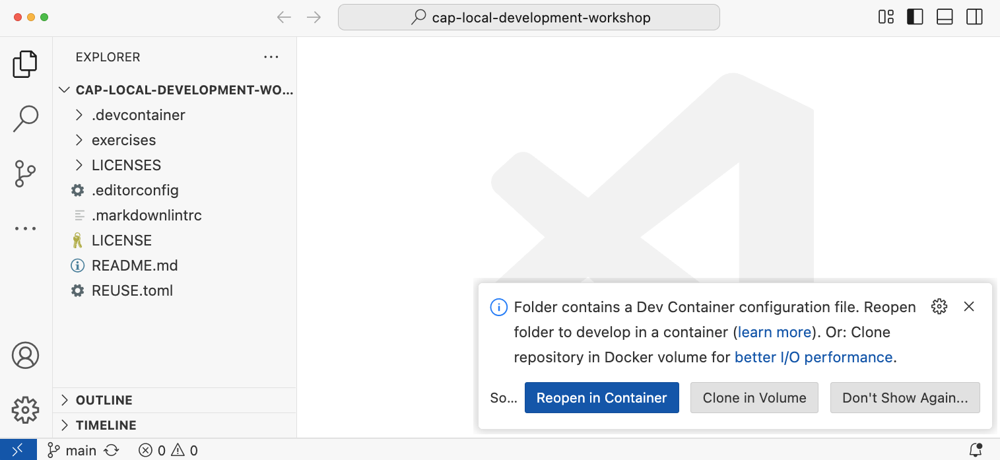
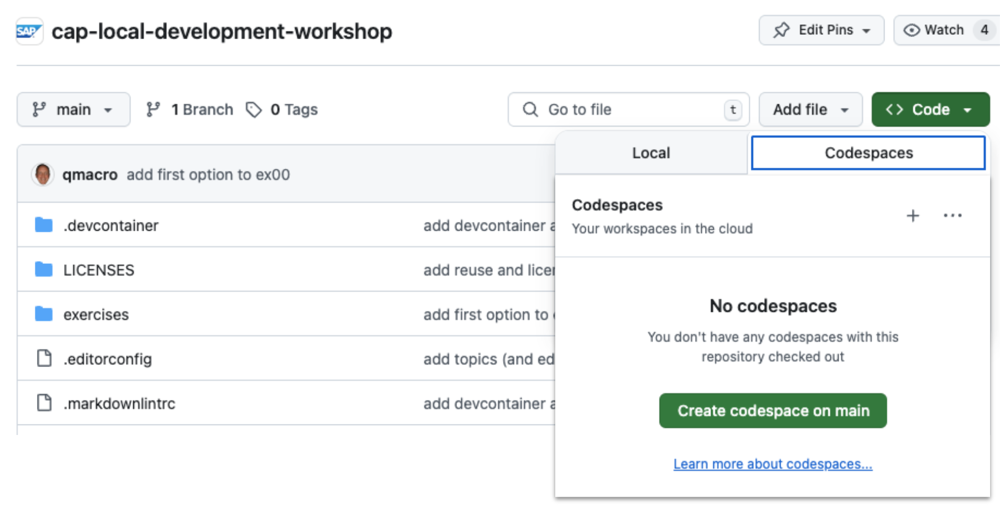
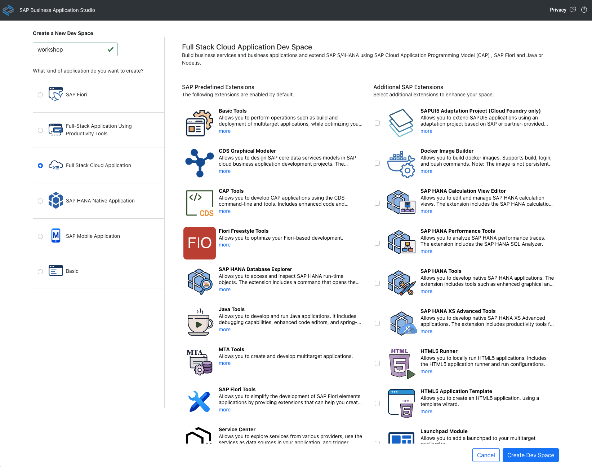
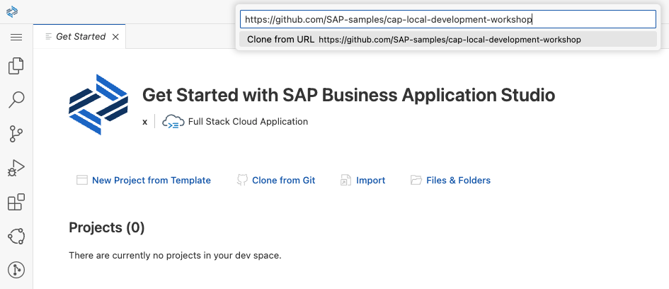
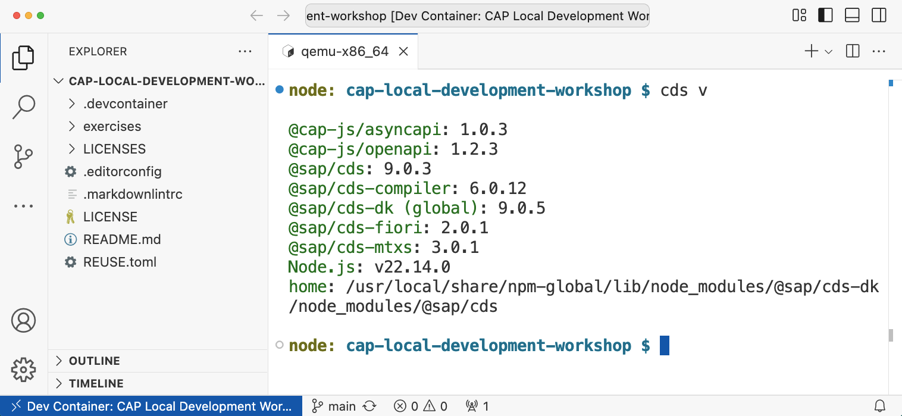

# Exercise 00 - setting up and getting to a running server

This workshop is all about local development, but we want to ensure that everyone has the same experience regardless of the machine, operating system and admin rights to install software. So there are different options you can take to set up and get ready to run through the exercises.

If you have everything set up for CAP Node.js development already, including Node.js 22 or 24, the latest release of CAP Node.js ([9.0.0+]), and an editor you're comfortable using, then you're all set and you can jump straight to and continue from the [Check CAP Node.js version](#check-cap-nodejs-version) section.

If not, then we have various options for you from which to choose.

Once you've got everything set up, you'll finish this exercise by initializing a new CAP Node.js project and starting up the CAP server.

## Set up working environment

Here are the options. 

> Only option 1 will allow for the completion of the `cds debug` based debugging in the last exercise, due to the construct and online context of the codespace / dev space; see the footnote in that exercise which shows an alternative way of debugging.

👉 Choose one of them, work through the steps, and then jump forward to continue on from the [check the CAP Node.js version](#check-cap-nodejs-version) section.

### Option 1 - dev container and VS Code installed locally

If you already have or can install git, Docker Desktop (see [footnote 1](#footnote-1)) and VS Code on your machine, then this option may be for you.

- Ensure Docker Desktop is running (and if you have a context set, ensure it points to the local engine)
- Check that you have the [Dev Containers] extension installed in VS Code
- Clone this repo using `git clone https://github.com/SAP-samples/cap-local-development-workshop`
- Open the directory containing the clone with VS Code, for example like this: `code cap-local-development-workshop`, or via the VS Code menu
- Choose to "Reopen in Container" when asked:
  

Then, so that everyone's working location is the same in all of the explicit options here:

- Open a terminal and create a symbolic link so that the cloned repository is (also, virtually) in the `$HOME/projects/` directory:

  ```bash
  cd $HOME/projects/ \
    && ln -s /workspaces/cap-local-development-workshop . \
    && cd cap-local-development-workshop
  ```

### Option 2 - dev container in a GitHub codespace

For our purposes, [GitHub codespaces] are essentially the same as a locally running container and VS Code ... but provided by GitHub and accessed via the browser.

- At the [home of this repo] on GitHub, use the "Code" button.
- Select the "Codespaces" tab.
- Choose to "Create codespace on main":
  
- When the codespace is ready (in another browser tab), you're all set

Then, just like option 1, so that everyone's working location is the same in all of the explicit options here:

- Open a terminal and create a symbolic link so that the cloned repository is (also, virtually) in the `$HOME/projects/` directory:

  ```bash
  cd $HOME/projects/ \
    && ln -s /workspaces/cap-local-development-workshop . \
    && cd cap-local-development-workshop
  ```

> 🚨 At the end of this workshop, when you're done, remember to delete the codespace so as not to incur costs!

### Option 3 - dev space in SAP Business Application Studio

This option is very much similar to the previous two options, in that it provides a VS Code based development environment and container. If you have a [trial account on the SAP Business Technology Platform], a [subscription to the SAP Business Application Studio], and the appropriate role collections assigned, then you can use this option.

- Go to the SAP Business Application Studio from your [SAP BTP trial landing page]
- Choose to "Create Dev Space", giving it a name and selecting the "Full Stack Cloud Application" type:
  
- Once the dev space is started, enter it, use the "Clone from Git" option to clone this repo, and choose to open it when prompted:
  

## Check CAP Node.js version

Once you have your working environment set up, check that CAP Node.js is installed (it should be) by opening up a terminal (menu option "Terminal -> New Terminal") and running `cds v`. The version for `@sap/cds-dk` should be [9.0.0+]. Here's an example from a terminal prompt from Option 1, but regardless of the option you chose, it should look similar:



## Create new CAP Node.js project

We'll explore local development friendly features starting with a simple CAP Node.js project, which you should create now. It's based on the `sample` [facet], which provides a ready-to-go sample schema and set of services, plus annotations and some actual data.

From a terminal prompt, initialize a new project called `myproj`, adding the `sample` facet; then move into that project's directory and install the NPM package dependencies:

```shell
cd $HOME/projects/cap-local-development-workshop/ \
  && cds init --add sample myproj \
  && cd $_ \
  && npm install
```

The output should appear similar to this:

```text
creating new CAP project in ./myproj

adding nodejs
adding sample

successfully created project – continue with cd myproj

find samples on https://github.com/SAP-samples/cloud-cap-samples
learn about next steps at https://cap.cloud.sap

added 127 packages, and audited 128 packages in 1m

23 packages are looking for funding
  run `npm fund` for details

  found 0 vulnerabilities
```

## Start the fast development cycle with cds watch

With the previous shell invocation you created a project from scratch. And now it's time to invoke `cds watch`, a command so powerful and fundamental to CAP Node.js rapid development that the humble [Capire entry for it] doesn't really do it justice :-)

```shell
cds watch
```

Take a brief look at the output, we'll be revisiting some of this in the next exercise!

```text
cds serve all --with-mocks --in-memory?
( live reload enabled for browsers )

        ___________________________

[cds] - loaded model from 9 file(s):

  node_modules/@sap/cds/srv/outbox.cds
  app/services.cds
  app/common.cds
  app/browse/fiori-service.cds
  app/admin-books/fiori-service.cds
  srv/cat-service.cds
  srv/admin-service.cds
  db/schema.cds
  node_modules/@sap/cds/common.cds

[cds] - connect using bindings from: { registry: '~/.cds-services.json' }
[cds] - connect to db > sqlite { url: ':memory:' }
  > init from db/data/sap.capire.bookshop-Genres.csv
  > init from db/data/sap.capire.bookshop-Books_texts.csv
  > init from db/data/sap.capire.bookshop-Books.csv
  > init from db/data/sap.capire.bookshop-Authors.csv
/> successfully deployed to in-memory database.

[cds] - using auth strategy {
  kind: 'mocked',
  impl: 'node_modules/@sap/cds/lib/srv/middlewares/auth/basic-auth'
}

[cds] - serving AdminService { impl: 'srv/admin-service.js', path: '/odata/v4/admin' }
[cds] - serving CatalogService { impl: 'srv/cat-service.js', path: '/odata/v4/catalog' }

[cds] - server listening on { url: 'http://localhost:4004' }
[cds] - server launched in: 497.749ms
[cds] - [ terminate with ^C ]
```

Here are a few things to notice, given that by default we're in development mode here (i.e. we haven't specified "production" mode):

- the CDS model that is loaded is made up of content from different sources
- by default there's a SQLite powered in-memory database in play
- there has been some initial data loaded for various entities
- mock authentication is used automatically
- two services are made available, via the OData adapter, and there are custom implementations for each of them

> From hereon in, any commands entered in subsequent exercises should be entered in the context of where we are right now, which is in this project's root, i.e. the `myproj/` directory ... unless otherwise stated.

---

[Next exercise](../01)

---

## Footnotes

<a name="footnote-1"></a>
### Footnote 1

There's no reason why e.g. [Podman] won't work instead of Docker; you're welcome to use that, but we cannot provide support for any issues arising in this workshop due to time constraints.

[GitHub codespaces]: https://github.com/features/codespaces
[9.0.0+]: https://cap.cloud.sap/docs/releases/may25
[Dev Containers]: https://marketplace.visualstudio.com/items?itemName=ms-vscode-remote.remote-containers
[home of this repo]: https://github.com/SAP-samples/cap-local-development-workshop
[trial account on the SAP Business Technology Platform]: https://developers.sap.com/tutorials/hcp-create-trial-account.html
[subscription to the SAP Business Application Studio]: https://developers.sap.com/tutorials/appstudio-onboarding.html
[SAP BTP trial landing page]: https://account.hanatrial.ondemand.com/trial/#/home/trial
[facet]: https://cap.cloud.sap/docs/tools/cds-cli#cds-add
[Capire entry for it]: https://cap.cloud.sap/docs/tools/cds-cli#cds-watch
[Podman]: https://podman.io/
