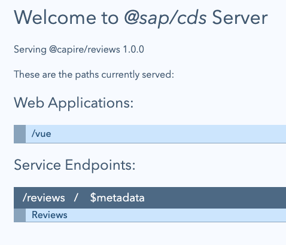

# Exercise 05 - workspaces, monorepos and more on messaging and events

As the late English Renaissance poet John Donne penned: [No man is an island]. And no CAP project is an island, either. While what we can create based on an invocation of `cds init` is enough for a standalone CAP service, it likely does not ... stand alone.

In Node.js the [workspaces] concept in NPM is often used to manage dependencies and supporting or related projects in the form of NPM packages. Think of workspaces as the next step up from the lower level [npm-link] concept. A key feature of workspace-based organization of related projects (packages) is that the development and use of those related projects ... can be done locally, that is without the need to involve the NPM package registry.

## Explore a simple workspace example for a CDS plugin package

CAP Node.js typically uses the workspace concept for the development of [CDS plugin packages]. There's a simple example of this in [CAP Node.js plugins - part 1 - how things work], which is worth exploring here first.

👉 We are done with the project we've been working on thus far, so first stop any running CAP servers and close any terminal and editor sessions.

### Initialize a new CAP Node.js project

👉 In a new terminal session window, initialize a new CAP Node.js project "plugintest" in the workshop root directory:

```bash
cd $HOME/projects/cap-local-development-workshop/ \
  && cds init plugintest && cd $_
```

👉 Examine the contents of `package.json`:

```bash
jq . package.json
```

The contents should look like this:

```json
{
  "name": "plugintest",
  "version": "1.0.0",
  "description": "A simple CAP project.",
  "repository": "<Add your repository here>",
  "license": "UNLICENSED",
  "private": true,
  "dependencies": {
    "@sap/cds": "^9",
    "express": "^4"
  },
  "engines": {
    "node": ">=20"
  },
  "devDependencies": {
    "@cap-js/sqlite": "^2",
    "@cap-js/cds-types": "^0.11.0"
  },
  "scripts": {
    "start": "cds-serve"
  }
}
```

So far so good. At this point let's imagine we're going to start working on a new plugin.

### Create the plugin package

👉 Create the plugin package using the workspace concept:

```bash
npm init -y --workspace myplugin
```

The output will typically look something like this:

```log
Wrote to /tmp/plugintest/myplugin/package.json:

{
  "name": "myplugin",
  "version": "1.0.0",
  "description": "",
  "main": "index.js",
  "scripts": {
    "test": "echo \"Error: no test specified\" && exit 1"
  },
  "keywords": [],
  "author": "",
  "license": "ISC",
  "type": "commonjs"
}

added 128 packages in 1m
```

### Add the dependency

👉 We can now declare a dependency, that our CAP project `plugintest` relies upon this new `myplugin` package. Do that now (remembering we're still in the top level `plugintest/` directory):

```bash
npm add myplugin
```

### Examine the package structure and relationship

Let's look at what we have now in terms of structure and declaration.

👉 First, check the contents of `plugintest`'s `package.json` file again:

```bash
jq . package.json
```

```json
{
  "name": "plugintest",
  "version": "1.0.0",
  "description": "A simple CAP project.",
  "repository": "<Add your repository here>",
  "license": "UNLICENSED",
  "private": true,
  "dependencies": {
    "@sap/cds": "^9",
    "express": "^4",
    "myplugin": "^1.0.0"
  },
  "engines": {
    "node": ">=20"
  },
  "devDependencies": {
    "@cap-js/cds-types": "^0.11.0",
    "@cap-js/sqlite": "^2"
  },
  "scripts": {
    "start": "cds-serve"
  },
  "workspaces": [
    "myplugin"
  ]
}
```

We now have:

- a new `workspaces` section listing the `myplugin` package location (from the `npm init -y --workspace myplugin`)
- an entry in the `dependencies` section for `myplugin` (from the `npm add myplugin`)

👉 Now check the overall filesystem structure, limiting the directory hierarchy levels displayed (with `-L`):

```bash
tree -L 2
```

This should show us (heavily reduced):

```log
.
├── README.md
├── app
├── db
├── eslint.config.mjs
├── myplugin
│   └── package.json
├── node_modules
│   ├── @cap-js
│   ├── @eslint
│   ├── @sap
│   ├── @types
│   ├── accepts
│   ├── ...
│   ├── myplugin -> ../myplugin
│   └── ...
├── package-lock.json
├── package.json
└── srv
```

Notice how the dependency (`plugintest` -> `myplugin`) is resolved via a _symbolic link_ to the workspace.

### Add a basic plugin hook

Just to complete this short exploration, let's create a basic plugin hook and start the `plugintest` CAP server.

👉 Add this to a new file `myplugin/cds-plugin.js`:

```javascript
console.log('Hello from myplugin')
```

> The `cds-plugin.js` name is [special].

👉 Now start the server:

```bash
cds w
```

whereupon you should see that the dependency is indeed realised (and also that the CDS plugin concept is really that simple):

```log
cds serve all --with-mocks --in-memory?
( live reload enabled for browsers )

        ___________________________

Hello from myplugin

    No models found in db/,srv/,app/,schema,services.
    Waiting for some to arrive...
```

👉 At this point we're done with this section, so delete this `plugintest/` directory:

```bash
cd .. && rm -rf plugintest/
```

## Explore monorepos powered by git submodules and NPM workspaces

Now we understand the basics of NPM workspaces, let's dig in further and add in the concept of [git submodules], which we can think of as a source code control system relation of NPM workspaces.

With git submodules, not only can we organize packages in workspaces, but also manage their sources with git, and combine a project and its dependencies into a single repository called a "monorepo" (where "mono" is short for "monolithic", which itself means "single [usually large] stone").

The [Microservices with CAP] topic in Capire covers this concept as a basis for the construction and management of a set of related and interdependent microservices, and has an example of a "deconstructed" version of the classic [cloud-cap-samples] monorepo. In this section we'll build up that monorepo manually using workspaces and pulling in individual git repositories as submodules.

### Create the top level project

The individual repository versions of CAP projects within the [cloud-cap-samples] monorepo are all to be found in the GitHub organization at <https://github.com/capire>, "the home for CAP samples and reference apps".

We'll create a top level project to be the "head" of the monorepo itself, and bring in individual CAP Node.js project repositories as git submodules, organizing them using the NPM workspace concept.

👉 Do that now in the simplest possible way:

```bash
cd $HOME/projects/cap-local-development-workshop/ \
  && mkdir capire \
  && cd $_ \
  && jq -n '{name: "@capire/samples", workspaces: ["*"]}' > package.json \
  && git init -b main \
  && printf "node_modules\ngen\n" > .gitignore
```

This is [the simplest thing that could possibly work] - a basic NPM project with just a name (in the form of a namespaced NPM package name) and a declaration allowing any subdirectory to be a workspace (that is, contain a dependent or related project package).

### Add the individual interdependent projects

The project has already been initialized from a git perspective, so we can now bring in the individual projects as submodules, and manage them locally in separate NPM workspaces.

👉 Do that now:

```bash
for project in bookstore reviews orders common bookshop data-viewer; do
  git submodule add "https://github.com/capire/$project"
done
git submodule update --init
```

### Install, wire up and inspect the dependencies

At this point there are multiple projects, as git submodule controlled NPM packages, each with their own `package.json` file, in the monorepo. While there are no dependencies declared in the top-level `package.json` file (there isn't even a `dependencies` section), the individual projects have dependencies. Let's examine the "bookstore" project's dependencies.

👉 Look at the `dependencies` list for the "bookstore" project:

```bash
jq .dependencies bookstore/package.json
```

We can see that this depends on (amongst other things) other peer projects in this monorepo:

```json
{
  "@capire/bookshop": "*",
  "@capire/reviews": "*",
  "@capire/orders": "*",
  "@capire/common": "*",
  "@capire/data-viewer": "*",
  "@sap-cloud-sdk/http-client": "^4",
  "@sap-cloud-sdk/resilience": "^4",
  "@sap/cds": ">=5",
  "express": "^4.17.1",
  "@cap-js/hana": ">=1"
}
```

At this point we're ready to have dependencies installed, so do that now (while still within the project root `capire/` directory):

```bash
npm install
```

👉 Now take a look at where packages have been installed:

```bash
find . -type d -name node_modules
```

This shows us that there is only a single `node_modules/` directory (at this level) for the entire monorepo:

```log
./node_modules
./node_modules/color/node_modules
./node_modules/body-parser/node_modules
./node_modules/send/node_modules
./node_modules/send/node_modules/debug/node_modules
./node_modules/express/node_modules
./node_modules/finalhandler/node_modules
```

Nothing has been installed in any of the project workspace directories. Indeed, part of the workspace concept enables the workspace projects to "look upwards" to the monorepo project root for what they need.

In the light of this, what's in the monorepo project's root `node_modules/` directory?

👉 Let's take a look, with:

```bash
tree -L 2 node_modules | more
```

This shows us something now familiar:

```log
node_modules
├── @cap-js
│   ├── db-service
│   ├── hana
│   └── sqlite
├── @capire
│   ├── bookshop -> ../../bookshop
│   ├── bookstore -> ../../bookstore
│   ├── common -> ../../common
│   ├── data-viewer -> ../../data-viewer
│   ├── orders -> ../../orders
│   └── reviews -> ../../reviews
├── @colors
│   └── colors
├── @dabh
│   └── diagnostics
├── @eslint
│   └── js
├── @sap
│   ├── cds
...
```

The dependencies to the various workspace project packages in the `@capire` namespace (`bookshop`, `bookstore`, etc) are realized ... _via symbolic links_.

This is a great way to organize interdependent projects (such as those in composite applications or in microservices scenarios), especially in a local development context.

👉 Keep this new `capire/` project setup as we'll use it in the next section.

## Produce and consume an event message

At the end of the previous exercise we had seen what an event message looks like "in the pipe", i.e. in the default `~/.cds-msg-box` file in the context of the file-based messaging channel.

To round out this exploration of monorepos powered by NPM workspaces and git submodules for local development, let's fire up a couple of the projects in our monorepo here, and have them communicate asynchronously, also using the file-based messaging channel.

### Clean out any current in-flight event messages

👉 To keep things tidy and clean up any in-flight event messages in our file-based messaging channel, let's remove the default `~/.cds-msg-box` file. It will get recreated when required:

```bash
rm ~/.cds-msg-box
```

### Start the reviews project

👉 Now start the "reviews" project, from the monorepo root, with:

```bash
cds w reviews
```

The "reviews" project provides a `ReviewsService` and also has a GUI served from the `app/` directory, available via the `/vue` link exposed on the [start page]; because of the setting in an `.env` file in the "reviews" project's root directory the CAP server listens on port 4005:



The log shows us that the "reviews" project uses the file-based messaging channel:

```log
[cds] - connect to messaging > file-based-messaging
```

and at this point the `~/.cds-msg-box` file is created anew.

### Add a review

👉 In the GUI at <http://localhost:4005/vue/index.html> (you'll need to authenticate, use one of the [pre-defined test users] we learned about in a previous exercise, say, "bob"), add a review, and then check both the CAP server log, and the contents of the `~/.cds-msg-box` file.

The log should show something like this:

```log
[odata] - PATCH /reviews/Reviews/1689144d-3b10-4849-bcbe-2408a13e161d
< emitting: reviewed { subject: '201', count: 2, rating: 4.5 }
```

And there should be a corresponding event message record written to the `~/.cds-msg-box` file, something like this:

```log
ReviewsService.reviewed {"data":{"subject":"201","count":2,"rating":4.5},"headers":{"x-correlation-id":"6ae4fb7a-884e-4da4-9b39-f0c174c096a4"}}
```

This brings us to the stage that is the equivalent of where we were at the end of the previous exercise.

### Examine the bookstore project and its requirements

👉 In another terminal session, move into this new `capire/` project directory and examine the "bookstore" project's CAP requirements, defined in `bookstore/package.json#cds.requires`:

```bash
cd $HOME/projects/cap-local-development-workshop/capire/ \
  && jq .cds.requires bookstore/package.json
```

> We could of course use `cds env requires` from within the `bookstore/` directory too.

This shows us that amonst other things, the "bookstore" project relies upon (will need to connect to) the `ReviewsService`:

```json
{
  "ReviewsService": {
    "kind": "odata",
    "model": "@capire/reviews"
  },
  "OrdersService": {
    "kind": "odata",
    "model": "@capire/orders"
  },
  "messaging": true,
  "db": true
}
```

Notice how the `model` references are specified, in NPM package name form.

From an earlier exercise we know that the `~/.cds-services.json` file acts as a local binding registry, a sort of "stock exchange" for required and provided services.

👉 Take a look at what's currently in that file:

```bash
jq . ~/.cds-services.json
```

It should show that there indeed is a `ReviewsService` being provided:

```json
{
  "cds": {
    "provides": {
      "ReviewsService": {
        "kind": "odata",
        "credentials": {
          "url": "http://localhost:4005/reviews"
        },
        "server": 74989
      }
    },
    "servers": {
      "74989": {
        "root": "file:///tmp/capire/reviews",
        "url": "http://localhost:4005"
      }
    }
  }
}
```

So we can work out what's probably going to happen next.

### Start the bookstore project

👉 Start this "bookstore" project up, again from the monorepo project root, with:

```bash
cds w bookstore
```

Here are some lines from the log output:

```log
[cds] - connect using bindings from: { registry: '~/.cds-services.json' }
...
[cds] - connect to messaging > file-based-messaging
...
[cds] - connect to ReviewsService > odata { url: 'http://localhost:4005/reviews' }
...

> received: reviewed { subject: '201', count: 2, rating: 4.5 }
```

This tells us:

- it looked in the `~/.cds-services.json` registry (and therefore found that the `ReviewsService`, which it requires, is available, and knows how to get to it)
- it also uses the file-based messaging channel
- it successfully marshalled the information needed to be able to make calls to the `ReviewService`

> We should refrain from saying "it successfully connected to ..." because at this point no connection has yet been attempted.

It also shows us that it received an event message!

👉 Take a look at the contents of `~/.cds-msg-box` now:

```bash
cat ~/.cds-msg-box
```

It's empty! The "bookstore" project consumed the event message.

Well done.

👉 Stop the CAP servers and close all but one of the terminals.

---

## Further reading

- [CAP Node.js Plugins], a three part blog post series
- [Reusable components for CAP with cds-plugin]
- [Microservices with CAP]

---

[Next exercise](../06)

---

[No man is an island]: https://allpoetry.com/No-man-is-an-island
[workspaces]: https://docs.npmjs.com/cli/v7/using-npm/workspaces
[CDS plugin packages]: https://cap.cloud.sap/docs/node.js/cds-plugins
[CAP Node.js plugins - part 1 - how things work]: https://qmacro.org/blog/posts/2024/10/05/cap-node.js-plugins-part-1-how-things-work/
[CAP Node.js Plugins]: https://qmacro.org/blog/posts/2024/12/30/cap-node.js-plugins/
[Reusable components for CAP with cds-plugin]: https://community.sap.com/t5/technology-blog-posts-by-sap/reusable-components-for-cap-with-cds-plugin/ba-p/13562077
[git submodules]: https://git-scm.com/book/en/v2/Git-Tools-Submodules
[Microservices with CAP]: https://cap.cloud.sap/docs/guides/deployment/microservices
[cloud-cap-samples]: https://github.com/SAP-samples/cloud-cap-samples
[the simplest thing that could possibly work]: https://creators.spotify.com/pod/profile/tech-aloud/episodes/The-Simplest-Thing-that-Could-Possibly-Work--A-conversation-with-Ward-Cunningham--Part-V---Bill-Venners-e5dpts
[npm-link]: https://docs.npmjs.com/cli/v9/commands/npm-link
[special]: https://cap.cloud.sap/docs/node.js/cds-plugins#add-a-cds-plugin-js
[start page]: http://localhost:4005/
[pre-defined test users]: https://cap.cloud.sap/docs/node.js/authentication#mock-users
