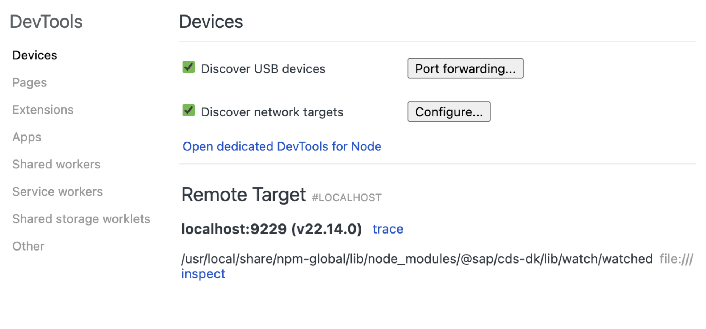
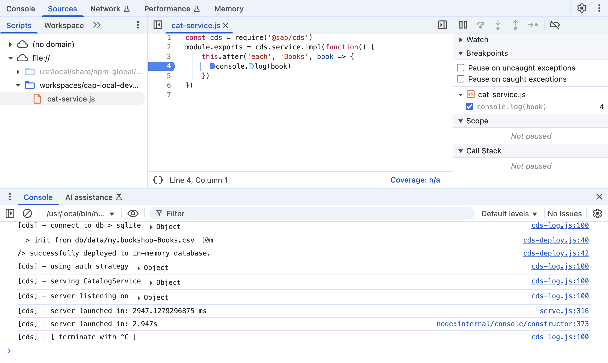
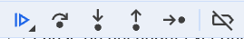
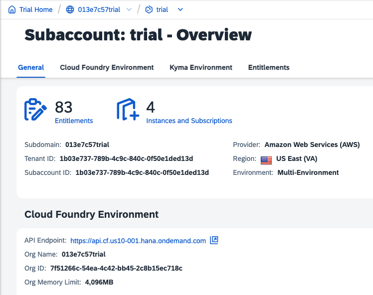

# Exercise 06 - debugging local and remote servers

The [Debugging] section of Capire tells us that with `cds debug` we can "_debug applications running locally or remotely on SAP BTP Cloud Foundry. Local applications will be started in debug mode, while (already running) remote applications are put into debug mode._".

The benefit of using the same procedure and in fact the same debugging tools regardless of whether the CAP server is local or remote is enormous. We can use our local development tools and the same techniques, and while connected to a remote server we can still remain "local" in our minds.

In this exercise we'll create a simple CAP project, run and debug it locally, then deploy it to Cloud Foundry (CF), connect to it and debug it remotely.

## Initialize a new CAP Node.js project

For this topic we'll limit ourselves to a simple CAP service.

👉 In a new terminal session window, initialize a new CAP Node.js project "debugtest" in the workshop root directory:

```bash
cd $HOME/projects/cap-local-development-workshop/ \
  && cds init --add tiny-sample debugtest \
  && cd $_ \
  && npm install
```

The `tiny-sample` facet brings in a super small books based service with a couple of data records, and it relies on the built-in service implementation as there are no JavaScript files alongside the service definition, as we can see:

```bash
; tree -I node_modules
.
├── app
├── db
│   ├── data
│   │   └── my.bookshop-Books.csv
│   └── schema.cds
├── eslint.config.mjs
├── package.json
├── README.md
└── srv
    └── cat-service.cds
```

👉 So that we have something simple to which we can attach a breakpoint when debugging, add a `srv/cat-service.js` file with this content:

```javascript
const cds = require('@sap/cds')
module.exports = cds.service.impl(function() {
    this.after('each', 'Books', book => {
      console.log(book)
    })
})
```

When debugging, we'll set a breakpoint on the `console.log(book)` line shortly.

## Debug locally

We're already all set - it's straightforward.

### Start the CAP server in debug mode

👉 Start debugging the service with `cds debug`, which as we'll see from the output is just shorthand for `cds watch --debug`:

```bash
cds debug
```

The output contains information relevant for our debugging session, but otherwise the CAP server is operating pretty much the same way as it does normally when started with `cds watch`:

```log
Starting 'cds watch --debug'

cds serve all --with-mocks --in-memory?
( live reload enabled for browsers )

        ___________________________

Debugger listening on ws://127.0.0.1:9229/2f95339d-33e9-4b40-9e24-461d1a75cc6c
For help, see: https://nodejs.org/en/docs/inspector
...

[cds] - serving CatalogService { impl: 'srv/cat-service.js', path: '/odata/v4/catalog' }

[cds] - server listening on { url: 'http://localhost:4004' }
```

The difference is that the Node.js process has been started with the `--inspect` option. See the link to the Node.js debugging content in the [Further reading](#further-reading) section.

Note the websocket address given: `ws://127.0.0.1:9229/<process-guid>`.

👉 That port 9229 is the default for Node.js debugging connections; let's see for ourselves, in another terminal session, that it's listening for connections:

```bash
netstat -atn | grep LISTEN
```

This should elicit output like this:

```log
tcp        0      0 127.0.0.1:33791         0.0.0.0:*               LISTEN
tcp        0      0 127.0.0.1:9229          0.0.0.0:*               LISTEN
tcp        0      0 0.0.0.0:2222            0.0.0.0:*               LISTEN
tcp6       0      0 :::4004                 :::*                    LISTEN
tcp6       0      0 :::2222                 :::*                    LISTEN
tcp6       0      0 ::1:35729               :::*                    LISTEN
```

In this list we can see the `127.0.0.1:9229` socket, as well as the `<any-host-address>:4004` representing the socket which is ready to accept incoming connections to the OData service served by the CAP server.

> An IP address or hostname combined with a port number is commonly referred to as a "socket".

### Start a debugging client

There are various debugging clients generally but the "classic" for this type of Node.js debugging is the Chrome Developer Tools, specifically the "Inspector".

👉 In a new tab in your Chrome (or Chromium) browser, go to address `chrome://inspect` where you should see something like this:



This shows a single debugging target ready to be attached to and inspected. From the detail we can see it's our CAP server.

> Don't be thrown by the fact that this target is listed in the "Remote Target" section; from the DevTools Inspector point of view, all these websocket based targets are "remote".

### Attach the inspector to the target

👉 Select the "inspect" link next to the target.

You should see this in the CAP server log:

```log
Debugger attached.
```

You should also be presented with an Inspector window that, if you've used DevTools in Chrome before, should be familiar:



👉 Initially your window may not look like what you see in this screenshot; follow these steps to get there:

- In the "Scripts" section (top left), drill down the `file://` tree to find and select `cat-services.js`.
- Once the `cat-services.js` content is displayed, select the `console.log` line with the line number to set a breakpoint there (this is indicated with the blue arrow).
- Press the Esc key to bring up the Console drawer in the bottom half, where you'll see the CAP server log output, and also have a prompt (`>`) which is effectively a regular DevTools console but in the context of the running process being debugged.

### Make a request for the books data

Beyond having an inspector attachment, the CAP server is otherwise running normally. So we can make requests as normal too.

👉 Make a request for the books data by visiting <http://localhost:4004/odata/v4/catalog/Books>.

The response will not immediately be returned, as the processing should have paused at the breakpoint.

👉 Switch over to the Inspector and explore; if you're stuck for something to do, use the prompt in the Console to change the title of the book(s) being returned, with e.g.:

```javascript
book.title = "my test book 1"
```

> Note that this is in the context of a handler in the "after" phase, specifically with the special "each" event, so the breakpoint will be visited twice, once for each book record being served. See the link in the [Further reading](#further-reading) section below for more on this.

👉 Use the controls in the Inspector to control the debugging flow:



## Push to Cloud Foundry

Now we have done a little bit of debugging with a locally running CAP server, let's push it to CF so we can try out debugging a remotely deployed instance. We'll push it in the simplest possible way, keeping the machinery to a minimum and retaining the "local" nature of the server, to avoid getting distracted with making it production-ready.

### Log in with the cf CLI

We'll use the `cf` CLI to make the push to CF.

👉 Use the credentials and API endpoint that you have been given in this workshop to log in.

If you have an active trial account on the SAP Business Technology Platform (BTP), with a CF environment instance, then you can of course use that instead; the API endpoint is indicated in the CF environment section of your trial account overview in the cockpit, as shown here:



You can use your SAP BTP trial account's username (email address) and password, but we recommend you use the `--sso` option to enable you to use your already signed-in status in the browser to get a code to authenticate with; the flow looks like this:

```log
; cf login -a https://api.cf.us10-001.hana.ondemand.com --sso
API endpoint: https://api.cf.us10-001.hana.ondemand.com

Temporary Authentication Code ( Get one at https://login.cf.us10-001.hana.ondemand.com/passcode ):
Authenticating...
OK


Targeted org 013e7c57trial.

Targeted space dev.

API endpoint:   https://api.cf.us10-001.hana.ondemand.com
API version:    3.194.0
user:           dj.adams@sap.com
org:            013e7c57trial
space:          dev
```

### Push the app

Once you're logged in, you can push the app. Let's do it in stages.

> Notice the terminology change slightly here - while we've been talking and thinking about what we have here as a service, provided by a running CAP server, from a CF perspective though it's an "app" ... as opposed to a (backing) "service".

👉 Determine your specific workshop identifier, which you'll be allocated and should use as a suffix to the app name on CF. The identifier will most likely be a number; in the following illustrations, we'll assume the identifier is `000`.

👉 First, push the app using the most basic form, specifying that it shouldn't yet be started (because we have a few settings we want to make before that happens):

```bash
cf push debugtest-000 -m 256M --no-start
```

👉 Now set "non-production" values for a couple of the app's environment variables (so that we can avoid the "productive" requirements such as using a production-ready DB like SAP HANA, and avoid having to configure and wire up a connection to a real authorization service):

```bash
cf set-env debugtest-000 NPM_CONFIG_PRODUCTION false
cf set-env debugtest-000 NODE_ENV testing
```

> See the link to NPM config in the [Further reading](#further-reading) section for more information.

At this point we'd be ready to start the app up in the Cloud Foundry environment. But there's one thing we need to do specifically to be able to debug it.

### Enable SSH for the app

In order for us to connect to the app when it's being inspected, we need to be able connect remotely to the websocket. That connection is achieved by means of an [SSH tunnel], i.e. a connection carried through a secure (remote) shell (SSH) session.

We need to ensure that we can make such SSH connections to the app, and CF allows [access to apps via SSH]. It's likely that SSH is by default not enabled for the app that we've just pushed; we can check, like this:

```bash
; cf ssh-enabled debugtest-000
ssh support is disabled for app 'debugtest-000'.
ssh is disabled for app
```

👉 Enable SSH for the app now, like this:

```bash
cf enable-ssh debugtest-000
```

This will emit something like this:

```log
Enabling ssh support for app debugtest-000 as dj.adams@sap.com...
OK

TIP: An app restart is required for the change to take effect.
```

We haven't yet started the app, so a start now will effect the SSH enablement too.

### Start the app

👉 Do that now, like this:

```bash
cf start debugtest-000
```

There's a lot of output that occurs, but as this exercise is not about CF, we'll just briefly show what you should see as a sign of success:

```log
Starting app debugtest-000 in org 013e7c57trial / space dev as dj.adams@sap.com...

Waiting for app to start...

Instances starting...

name:                debugtest-000
requested state:     started
isolation segment:   trial
routes:              debugtest-000.cfapps.us10-001.hana.ondemand.com
last uploaded:       Wed 02 Jul 06:31:39 UTC 2025
stack:               cflinuxfs4
buildpacks:
isolation segment:   trial
        name               version   detect output   buildpack name
        nodejs_buildpack   1.8.38    nodejs          nodejs

type:           web
sidecars:
instances:      1/1
memory usage:   256M
     state     since                  cpu    memory     disk       logging        cpu entitlement   details
#0   running   2025-07-02T06:31:53Z   0.0%   0B of 0B   0B of 0B   0B/s of 0B/s   0.0%
```

## Debug remotely

The moment of truth has arrived.

👉 Use the same `cds debug` command as earlier, but this time specify the app name:

```bash
cds debug debugtest-000
```

This time, the output is slightly different:

```log
Found process of type node, ID: 256

Opening SSH tunnel on 9229:127.0.0.1:9229
Opening Chrome DevTools at devtools://devtools/bundled/inspector.html?ws=localhost:9229/16af26a1-064e-4994-8b3a-97f29780e61e

> Now attach a debugger to port 9229.
> Keep this terminal open while debugging.
> See https://cap.cloud.sap/docs/tools/cds-cli#cds-debug for more.
...
```

You can see that an SSH tunnel has been established, with this description: `9229:127.0.0.1:9229`. This means that the `cds debug` mechanism has made an SSH connection to the app on CF, and used SSH's tunnel facility to create a tunnel, between port 9229 on the "local" host (that's the first `9229` in the description string) and port 9229, listening on 127.0.0.1 on the "remote" host (that's the `localhost:9229` in the description string). The upshot of this is that if a connection is made to "local" port 9229, it's forwarded through the tunnel to port 9229 on the "remote" host, which is the host where our debugtest app is running.

This means that we can use our DevTools just like before, and connect just like before as well, as though the app being inspected were "local".

Follow the same procedure as we did earlier in [Start a debugging client](#start-a-debugging-client) and debug just like you did before too.

It's (almost) magic!

---

## Further reading

- The [Debugging] topic in Capire
- [Node.js debugging]
- [Debugging JavaScript with Chrome DevTools]
- [Method: srv.after(request)]
- [NPM config]

[Debugging]: https://cap.cloud.sap/docs/tools/cds-cli#cds-debug
[Node.js debugging]: https://nodejs.org/en/learn/getting-started/debugging
[Debugging JavaScript with Chrome DevTools]: https://developer.chrome.com/docs/devtools/javascript
[Method: srv.after(request)]: https://cap.cloud.sap/docs/node.js/core-services#srv-after-request
[NPM config]: https://docs.npmjs.com/cli/v9/using-npm/config
[SSH tunnel]: https://www.ssh.com/academy/ssh/tunneling
[access to apps via SSH]: https://docs.cloudfoundry.org/devguide/deploy-apps/ssh-apps.html
